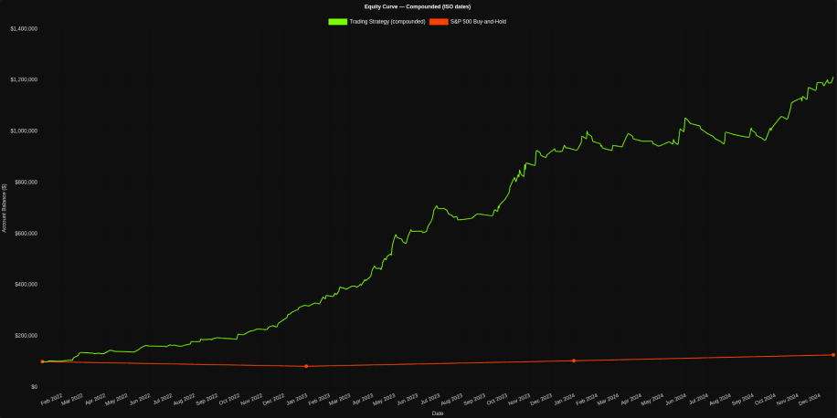

# Systematic Intraday Futures Strategy

 

## 1. Executive Summary
A systematic, rule-based trading strategy developed for US Index Futures (NASDAQ, S&P 500,DOW). The approach combines **Technical Price Action** with **Macro-Economic Context** to identify high-probability setups during the New York Session.

Unlike theoretical models, this strategy was built on live market experience, focusing on event risk (News/CPI) and specific intraday volatility windows.

---

## 2. Performance Matrix (Historical Simulation)
*Data Period: Jan 2022 - Dec 2024*

| Metric | Result | Note |
| :--- | :--- | :--- |
| **Total Return** | **+1,100%** | Compounded Growth |
| **Sharpe Ratio** | **6.94** | High reward relative to variance |
| **Max Drawdown** | **-8.0%** | Strict risk management rules |
| **Avg Risk:Reward** | **1 : 3.38** | Asymmetric payout focus |

---

## 3. Core Strategy Pillars
The strategy is not a "black box" algorithm but a discretionary system with rigid rules:

### A. Economic & Event Filtering
* [cite_start]**News Avoidance:** Trading is suspended during high-impact economic releases (CPI, FOMC, NFP) to avoid binary outcome risks[cite: 135].
* [cite_start]**Holiday Logic:** Reduced exposure during low-liquidity bank holidays[cite: 137].

### B. Systematic Entry & Exit
* [cite_start]**Time-Based Execution:** Strictly trades the NY Session (15:00 - 16:30) to capture peak volume[cite: 21].
* **Price Structure:** Uses key technical levels (Support/Resistance/Trends) combined with momentum validation.
* [cite_start]**Selection:** "Quality over Quantity"—days with conflicting signals result in no trade[cite: 138].

### C. Risk Management
* [cite_start]**Hard Limits:** Maximum risk per trade is capped at 1% of account equity[cite: 13].
* [cite_start]**Capital Preservation:** The primary goal is protecting the downside; profits are a function of letting winners run (Avg 3.38% return per winning trade)[cite: 26].

---

## 4. Verification
* [Download Detailed HTML Backtest Report](./Equity%20Curve%20With%20Compounding.html)
